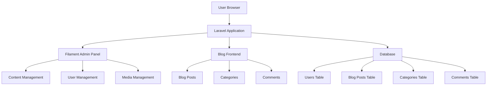
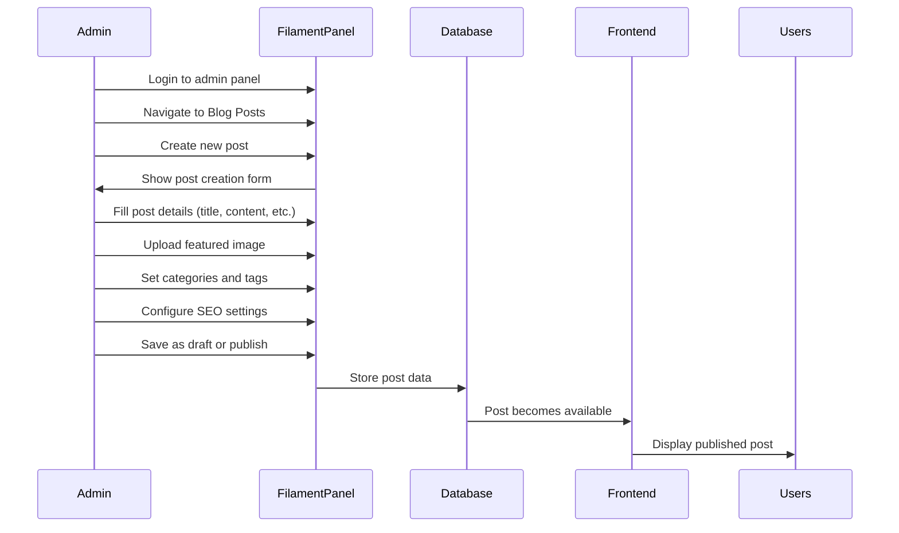
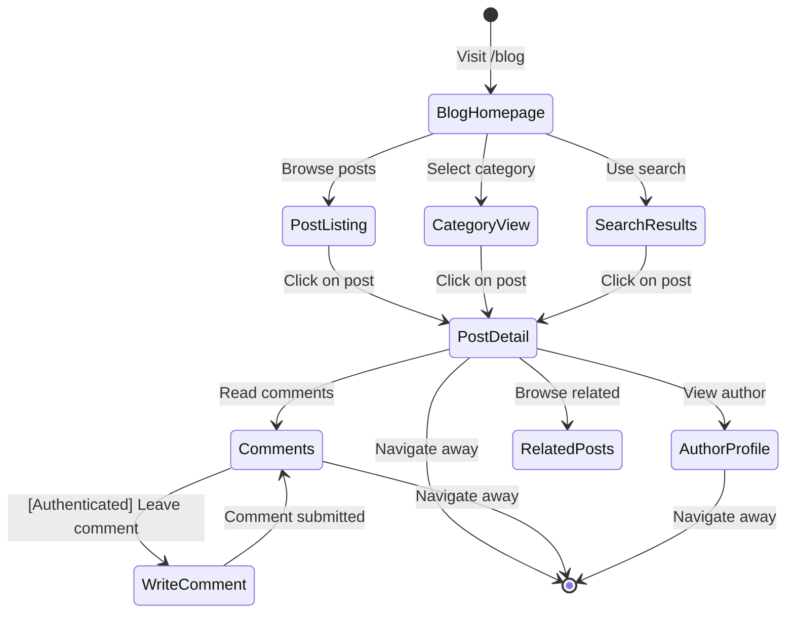
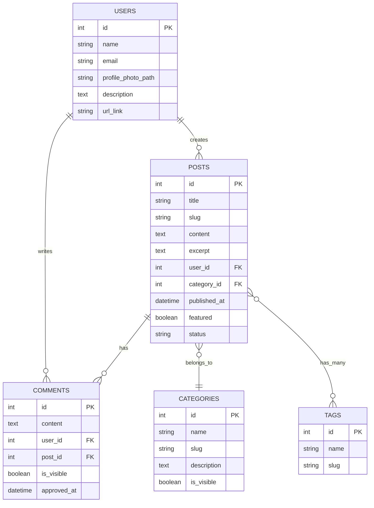
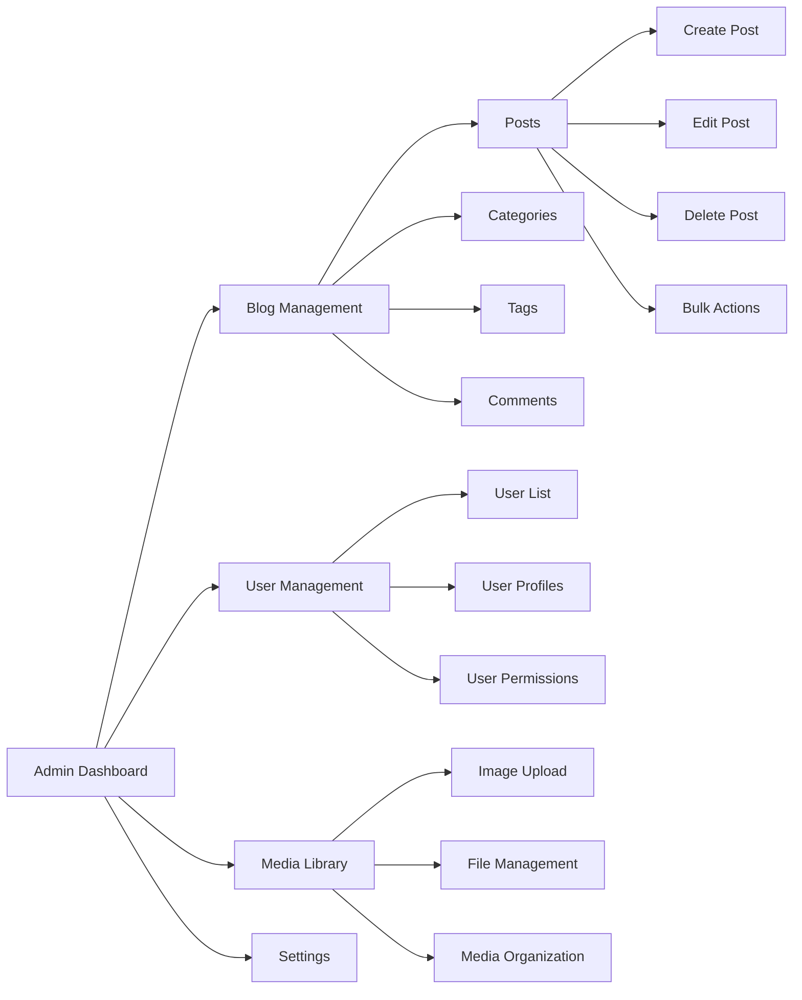
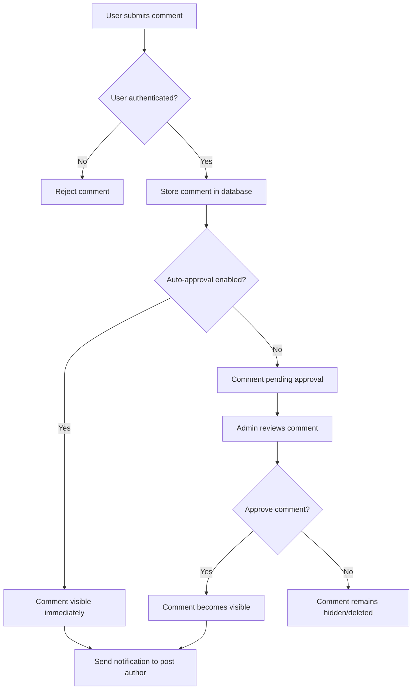
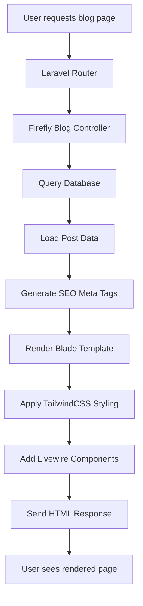

# System Workflow Diagrams

## Overall Architecture

## Content Creation Workflow

## User Interaction Flow

## Database Relationships

## Admin Panel Structure

## Comment Moderation Flow

## SEO and Frontend Rendering

These diagrams provide a visual representation of how the blog system works at different levels, from high-level architecture to specific workflows and data relationships.